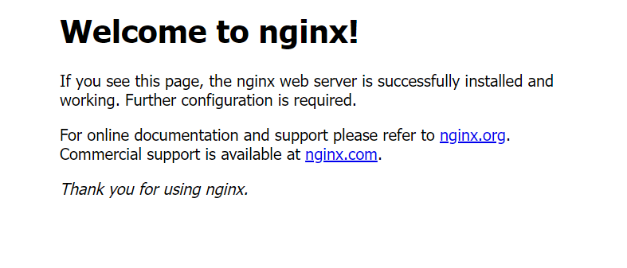

# Лабораторная работа №1 - Настроить Nginx 

---
## Цель работы

Научиться настраивать конфигурацию Nginx исходя из требований проектов.

---

## Ход работы

### 1. Установка nginx

Для установки Nginx на Ubuntu следуем следующим шагам:

 1. `sudo apt update` — Обновим списки пакетов
 2. `sudo apt install nginx` — Установим _Nginx_
 3. `sudo systemctl enable nginx` — Добавим _Nginx_ в автозагрузку
 4. `sudo service nginx status` — Проверим статус Nginx
 5. `sudo systemctl is-enabled nginx` — Убедимся, что _Nginx_ доступен в автозагрузке

Так же, если ввести в адресной строке браузера `localhost`, то должна отобразиться приветственная страница _Nginx_:




### 2. Подготовка проектов

Можно взять любой проект или одностраничный _html_. Если у вас полноценный микросервис, то нам нужен _build_ проекта для 
этого выполним команду:
```bash
npm run build
```
Название команды может отличать в зависимости от настроек проекта. Инструкции можно посмотреть в `package.json`.

Следующим шагом нам следует скопировать директорию проекта в `/var/www/` для этого выполним следующую команду для 
каждого билда:
```bash
sudo cp -r ../../home/qoudo/optimization-methods/lab_1/project_2 project2.com 
```
Путь и название файлов у вас может отличаться. В данном случаи команда выполняется в `/var/www/`.

### 3. Создание SLL сертификата

В рамках нашей задачи нужно создать _SLL_ сертификат для `https` соединений. Для простоты решения используем _openssl_:
```bash
openssl req -x509 -nodes -days 365 -newkey rsa:2048 -keyout /usr/share/nginx/sert/private.key -out  /usr/share/nginx/sert/selfsigned.crt
```
В процессе генерации вас попросят ввести ваши данные, такие как: пароль, город, страна и т.п. заполняем как есть
и после этого у нас сгенерируется сертификат с ключом в директории `/usr/share/nginx/sert/`:

Так же вы можете создать сертификат через certbot или другой сторонний сервис или купить, но в рамках нашей задачи
достаточно _openssl_.

```
private.key 
selfsigned.crt
```

### 4. Настройка конфигурации
Откроем файл конфигурации `default.conf`, найти его можно в `etc/nginx/conf.d`:
```bash
sudo nano default.conf
```
Избавимся от дефолтной конфигурации и напишем свою:

```nginx
server { 
    # Указываем, что сервер будет слушать запросы на порту 80 (HTTP).
    # Определяем имя сервера, которое будет использоваться для обработки запросов. 
    # В данном случае используется подстановочный знак _, который соответствует любому имени сервера.
    # И перенаправляем все HTTP-запросы на HTTPS. Это делается путём возврата кода состояния HTTP 301 
    # (Moved Permanently), который указывает браузеру, что ресурс был перемещён навсегда на новый URL. 
    # Новый URL формируется путём добавления https к имени хоста ($host) и сохранения 
    # исходного пути запроса ($request_uri).
    
    listen 80 default_server;
    server_name _;
    return 301 https://$host$request_uri;
}

 # Определям два сервера, каждый из которых будет слушать запросы на порту 443 (HTTPS) и обрабатывать запросы, 
 # соответствующие определённому имени сервера (local.project1.com и local.project2.com соответственно).
 
 # Для локальной отладки используем префикс "local.", если же вы настраиваете конфигурацию на удаленном сервере, 
 # то стоит указать "www".

server {
    listen 443 ssl;
    server_name local.project1.com;

    # Указываем на файлы сертификата SSL и ключа, которые будут использоваться для шифрования данных между 
    # клиентом и сервером.

    ssl_certificate /usr/share/nginx/sert/selfsigned.crt;
    ssl_certificate_key /usr/share/nginx/sert/private.key;
     
    # Определяем правила обработки запросов. В данном случае:
    # - location / — указывает, что все запросы, начинающиеся с корня сайта (/), должны обрабатываться указанным 
    # блоком конфигурации.
    # - location /images/ — указывает, что все запросы, начинающиеся с /images/, должны обрабатываться путём 
    # поиска файлов в каталоге /var/www/project1.com/images/.

    location / {
    
        # Ограничиваем количество одновременных запросов к серверу, чтобы предотвратить его перегрузку.
        limit_req zone=req_limit burst=10 nodelay;
        
        # Указываем корневые каталоги сервисов, где находятся файлы, которые должны быть обработаны сервером.
        root /var/www/project1.com; 
        index index.html;
    }

    location /images/ {
      
      # Используем "alias" для обслуживания файлов, находящихся за пределами указанного корневого каталога (root). 
      # Она позволяет Nginx искать файлы в указанном каталоге и обслуживать их, как если бы они находились 
      # в корневом каталоге.
       alias /var/www/project1.com/images/;
    }
}

server {
     listen 443 ssl;
     server_name local.project2.com;

     ssl_certificate /usr/share/nginx/sert/selfsigned.crt;
     ssl_certificate_key /usr/share/nginx/sert/private.key;

     location / {
         limit_req zone=req_limit burst=10 nodelay;
         root /var/www/project2.com;
         index index.html;
     }
}
```
Выполним комбинацию нажатий клавиш `Ctrl + S` (save - сохранить) и `Ctrl + X` (exit - выйти, закрыть редактор).
Но на этом не всё, нам следует ещё настроить основную конфигурацию `nginx.conf`. Выполним команду:
```bash
cd .. && sudo nano nginx.conf
```

Настроем нашу конфигурацию, добавим две строчки описанные комментарием:
```nginx
user  nginx;
worker_processes  auto;

error_log  /var/log/nginx/error.log notice;
pid        /var/run/nginx.pid;


events {
    worker_connections  1024;
}


http {
    include       /etc/nginx/mime.types;
    default_type  application/octet-stream;

    # Ограничим количество HTTP-запросов от пользователей в определенный промежуток времени.
    # Полезно для усиления безопасности веб-сервера, например, для замедления перебора паролей злоумышленником 
    # или для предотвращения DDoS-атак
    limit_req_zone $binary_remote_addr zone=req_limit:10m rate=5r/s;

    log_format  main  '$remote_addr - $remote_user [$time_local] "$request" '
                      '$status $body_bytes_sent "$http_referer" '
                      '"$http_user_agent" "$http_x_forwarded_for"';

    access_log  /var/log/nginx/access.log  main;

    sendfile        on;
    #tcp_nopush     on;

    keepalive_timeout  65;
    
    # Включим сжатия данных. Это позволяет уменьшить размер передаваемых данных между сервером и клиентом, 
    # что ускоряет загрузку страниц и экономит трафик.
    # При желании можно добавить дополнительные параметры gzip, ознакомиться с нми можно в документации nginx.
    gzip  on;

    include /etc/nginx/conf.d/*.conf;
}
```
Сохраняем изменения и выходим из редактора. Проверим нашу конфигурацию на наличие ошибок:
```bash
sudo nginx -t
```
В случаи успеха мы увидим сообщение:
```
nginx: the configuration file /etc/nginx/nginx.conf syntax is ok
nginx: configuration file /etc/nginx/nginx.conf test is successful
```
Теперь нам надо внести изменений в файл `hosts` это позволит временно перенаправлять запросы на локальные версии 
доменов и использовать нашу тестовую среду. Выполним команду:
```bash
sudo nano /etc/hosts
```
Добавим наши домены из конфигурации в `hosts`:
```
127.0.0.1       local.project1.com
127.0.0.1       local.project2.com
```
Сохраним изменения и закроем файл. На этом настройка конфигурации закончена.

### 5. Первый запуск и проверка работоспособности

После того как мы успешно настроили конфигурацию перейдем к проверке нашего сервера. Но перед этим его необходимо
перезапустить, что бы подтянулись наши изменения конфигурации. Выполним команду:

```bash
sudo systemctl restart ngin
```
Откроем браузер и введем в адресную строку: `local.project1.com`. Мы должны попасть на главную страницу нашего сервиса:


Проверим работу нашего алиаса перейдя по адресу: `local.project1.com/images/like-inactive.49570bcb1d637fdb38e5.svg`.
И увидим _svg_ изображение из нашего сервиса.


Аналогично проверим второй сервис по адресу `local.project2.com`:


Можем заметить, что браузер ругается: _адрес не защищен_, т.к. у нас не действительный сертификат:


В данный момент для нас это не критично, сейчас нам главное убедиться, что он подключен:


---

## Вывод

В результате мы научились:
 - Настраивать принудительное перенаправление HTTP-запросов на HTTPS;
 - Использовать _alias_ для создания псевдонимов путей к файлам или каталогам на сервере;
 - Настраивать виртуальные хосты для обслуживания нескольких доменных имен на одном сервере;
 - Создавать самописные _SSL_ сертификаты;
 - Добавлять ограничения/защиту для сервера от DDoS-атак, пускай посредственную, но хоть какую;
 - Узнали для чего применяется директива _gzip_.
