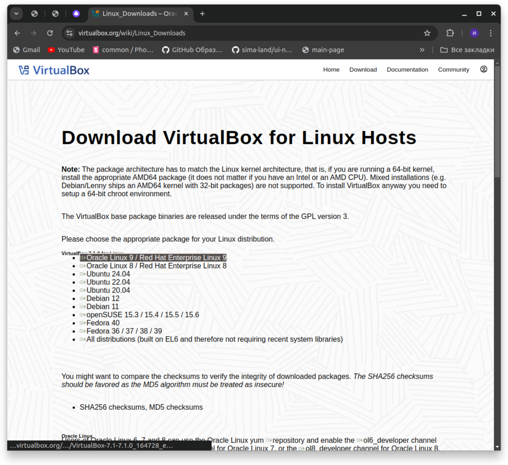
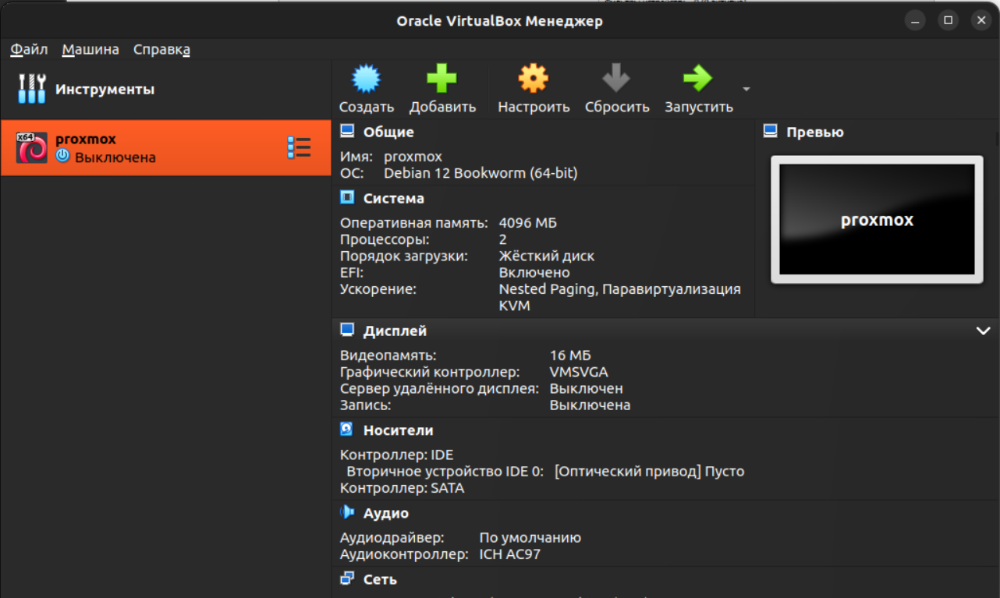
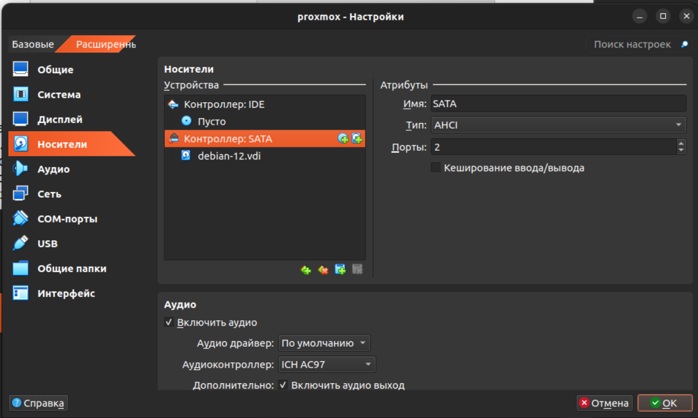
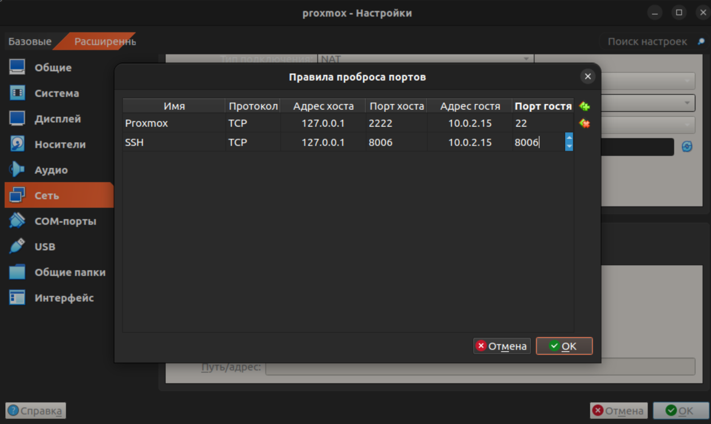
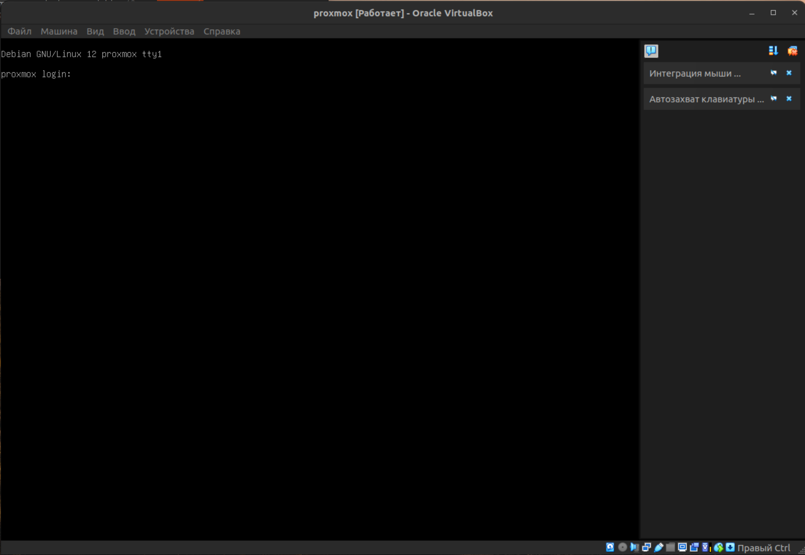
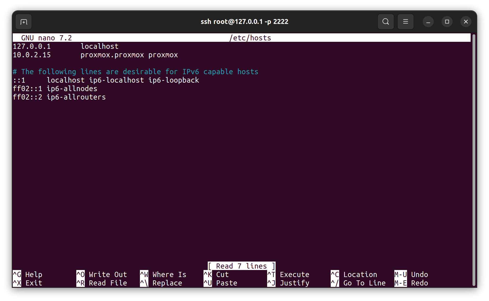
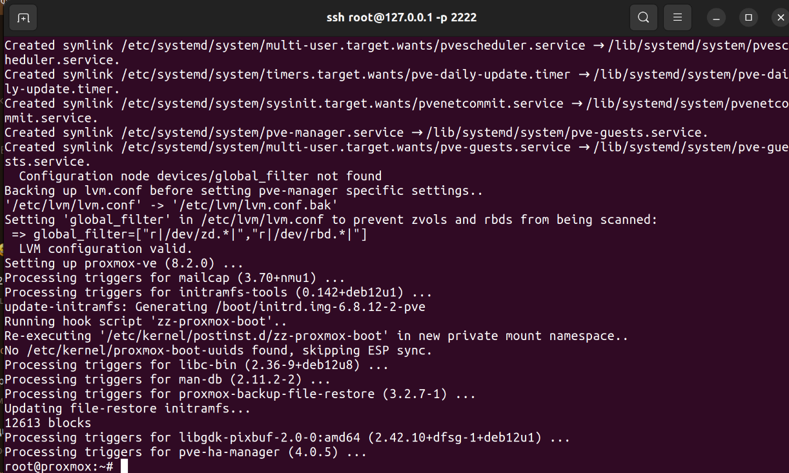

# Лабораторная работа №1 - Установка Proxmox

## Цель работы

Научиться устанавливать и настраивать _Proxmox_ для первого запуска.

## Ход работы

### 1. Установка _VirtualBox_

Для начала установить _VirtualBox_ на нашу ОС. В моём случае это будет _Ubuntu_.
Переходим на [офф. сайт](https://www.virtualbox.org/) _VirtualBox_, выбираем дистрибутив для нашей ОС.



После скачивания устанавливаем программу с помощью менеджера приложений.

### 2. Установка и настройка ВМ (виртуальная машина)

Скачиваем образ _Debian_ по [ссылке](https://lmsys001.pnpi.spb.ru:2180/s/o4ACycppPnPdBwC) и разархивируем.
Запускаем _VirtualBox_ и добавляем наш образ, а точнее файл `debian-12.vbox`.



В разделе **Инструменты** выбрать **Носители**, удалить лишний `debian-12.vdi` (будет помечен восклицательным знаком). 
Вместо него импортировать тот, который был приложен в архиве (с таким же именем).


После этого перейти в настройки машины, раздел **Носители**, и добавить этот диск в раздел **Контроллер**: 
SATA в качестве основного.



Сделать проброс портов для _Proxmox_ SSH, **Настроить/Сеть/Дополнительно/Проброс портов**. 
Адрес хоста – localhost, адрес гостя – адрес ВМ, посмотреть его можно после логина командой: 

```bash
ip a
```
По умолчанию он `10.0.2.15`



> Есть шанс, что со включенными VPN-ами проброс портов (да и вообще сеть) VirtualBox будет работать некорректно – 
> могут быть конфликты сетей между собой

Пробуем запустить нашу систему



> В случаи, если в процессе запуск виртуальной машины у вас появиться ошибка: Kernel driver not installed (rc=-1908)
> 
> Следуйте следующим шагам:
> 1. Откройте терминал с правами администратора (root).
> 2. Выполните команду:  `/sbin/vboxconfig`
> 3. Если ваша система имеет включенную безопасную загрузку EFI, вам также может потребоваться подписать модули ядра (vboxdrv, vboxnetflt, vboxnetadp, vboxpci), прежде чем вы сможете их загрузить. Для этого обратитесь к документации вашей системы Linux для получения дополнительной информации.
> 
> Это должно помочь решить проблему с загрузкой драйвера ядра _VirtualBox_.

### 3. Установка и настройка proxmox

Для упрощения процесса подключимся к ВМ по SSH. Выполним команду:

```bash
ssh root@127.0.0.1 -p 2222
```

После чего введем пароль от пользователя, если он установлен и войдем в систему.


Обновляем запись в `/etc/hosts`, чтобы по хостнейму _Proxmox_ возвращался валидный IP-адрес:

```bash
nano  /etc/hosts
```



Добавляем репозитории, которые будем устанавливать для установки _Proxmox_ и цифровую подпись:

```bash
echo "deb [arch=amd64] http://download.proxmox.com/debian/pve bookworm pve-no-subscription" > /etc/apt/sources.list.d/pve-install-repo.list
```

```bash
wget https://enterprise.proxmox.com/debian/proxmox-release-bookworm.gpg -O /etc/apt/trusted.gpg.d/proxmox-release-bookworm.gpg
```


Обновим репозитории и установим _Proxmox_:

```bash
apt update && apt install ifupdown2 proxmox-ve open-iscsi
```



### 4. Первый запуск Proxmox, тест-кейс

Перезапустим нашу ВМ и в браузере вводим следующий адрес https://127.0.0.1:8006.
Если мы сделали всё правильно, но увидим веб-морду _Proxmox_ и _popup_ авторизации, авторизовываемся, радуемся!


## Вывод

В результате мы научились:
  - Устанавливать VirtualBox;
  - Настраивать ВМ, т.е. пробрасывать порты и настраивать контроллер;
  - Устанавливать и настраивать Proxmox для первого запуск;
  - Подключаться по shh к ВМ;
  - Вносить изменения в `/etc/hosts`.


[назад](../PROXMOX.md) | [меню](../../README.md) | [вперёд](../lab_2/REPORT.md)
