# Лабораторная работа №2 - Знакомство с _LXC_-контейнерами

## Цель работы

Научится поднимать контейнеры с помощью _Proxmox_

## Ход работы

Перед началом работы запустим нашу ВМ и откроем веб-морду _Proxmox_ (с.м. [лабораторная работа №1](../lab_1/REPORT.md)).

### 1. Создание сетевого интерфейс типа - bridge

Щёлкните на узле (в нашем случае это _Proxmox_) и перейдите в раздел `Система → Сеть`. Там вы увидите единственный 
сетевой интерфейс по умолчанию, который также является основным сетевым интерфейсом ранее созданной ВМ.

Для создания ВМ и контейнеров в _Proxmox_ необходимо использовать сетевой интерфейс типа _bridge_ (мост), 
поэтому существующий интерфейс нам не подойдёт. Чтобы создать новый мост, нажмите `Создать → Linux Bridge`. 
При создании важно учесть три момента:

1. IP-адрес должен быть таким же, как установлен на базовой ВМ, в нашем случае это `10.0.2.15/24`.
2. В качестве шлюза необходимо указать `10.0.2.2` (его можно проверить заранее, выполнив на ВМ команду 
`ip r` и взяв значение из строки _default via_).
3. В качестве порта моста укажите имя сетевого интерфейса по умолчанию.

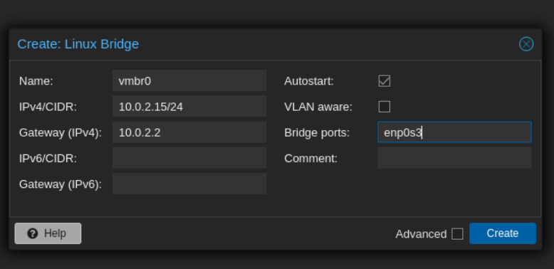

> Только после того, как вы создали мост, можно нажимать кнопку `Apply configuration`. Но перед этим рекомендуется 
> ещё раз всё проверить, потому что если вы допустили ошибку, то потеряете сетевой доступ к _Proxmox_, включая 
> веб-интерфейс. В этом случае придётся заново выполнять [Лабораторную работу №1](../lab_1/REPORT.md).

Если всё сделано правильно, то сетевой доступ сохранится и основной интерфейс станет интерфейсом типа _bridge_. 
Это можно проверить, например, подключившись к ВМ по SSH и выполнив команду `ip a`.


### 2. Создание контейнера _Redis_

Чтобы создать контейнеры, нужен как минимум базовый образ для контейнера. Это может быть обычный Linux-образ или 
готовый образ с предустановленным ПО. В _Proxmox_ это называется _template_ (шаблон). Давайте попробуем создать контейнер 
с _Redis_. Для этого нужно зайти в меню `CT Templates`.

Для тренировки подойдёт любой публичный образ. Поэтому просто нажмите кнопку `Templates` и найдите нужный шаблон с 
_Redis_, затем нажмите `Download`. Начнется процесс загрузки, прогресс можно отслеживать во вкладке `Output` или `Status`
как на скриншотах ниже:


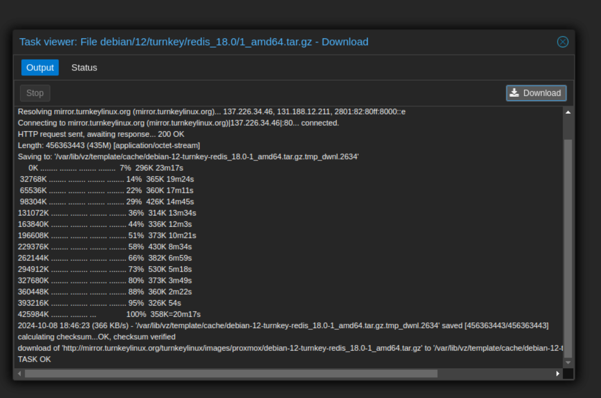

Чтобы создать контейнер, нажмите кнопку `Create CT` в правом верхнем углу. Все настройки можно оставить по умолчанию, 
кроме _IPv4_ в разделе `Network` — нужно выбрать селектор `DHCP`. В качестве шаблона выберите только что скачанный 
_Redis_. Также важно запомнить/записать `Hostname` и пароль на первой вкладке, они понадобятся позже.

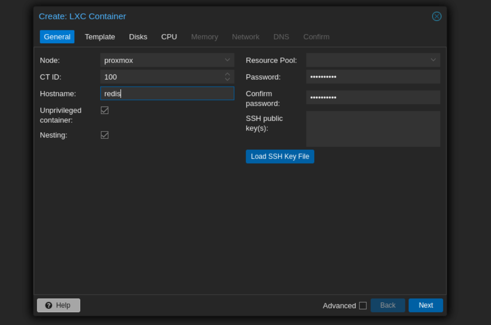


Если вы получили `TASK OK`, значит, всё создано успешно. 


Теперь можно войти в контейнер для его первоначальной настройки нажав кнопку инициализации справа вверху. 
Когда инициализация закончиться нажмите на только что созданный контейнер в меню слева и выберите пункт 
`Console`. Логин — `root`, пароль указывался на первой вкладке при создании контейнера.

При первом запуске просят придумать пароль для будущей админки _Redis_, введите любой. Интерфейс для подключения 
выбираем `all`. `Protected-mode` — выключить. Всё остальное пропускаем.


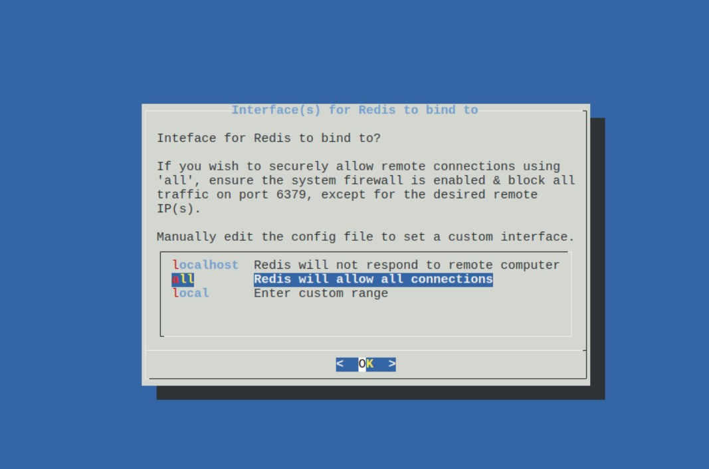

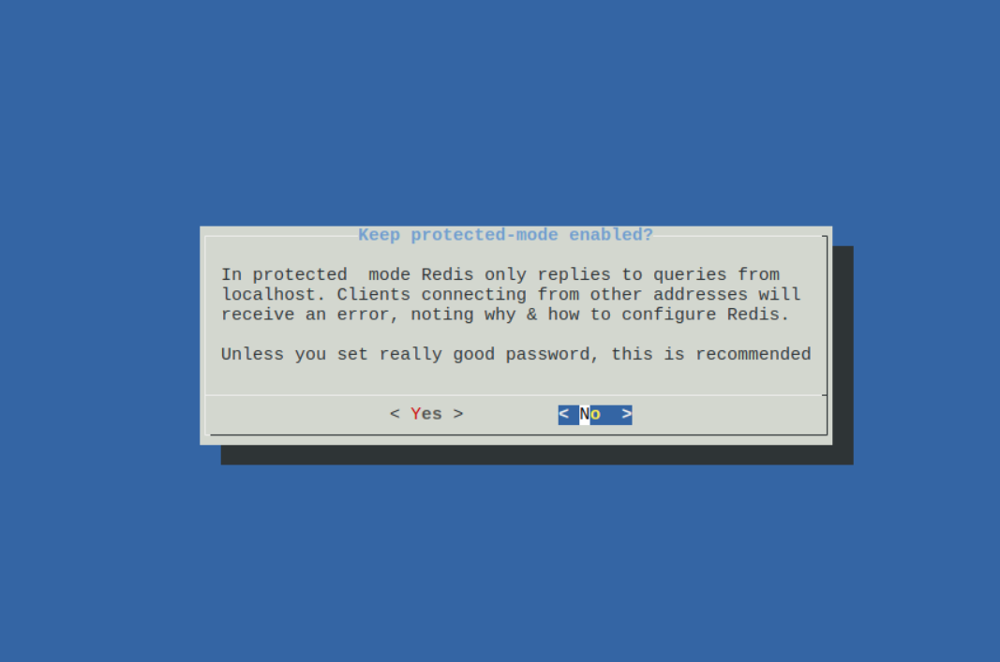

Последний экран важен, его лучше сохранить: на нём перечислены адреса и порты доступов до _redis_. 
На этом этапе настройка считается завершённой, готовым контейнером с _redis_ можно пользоваться по назначению.

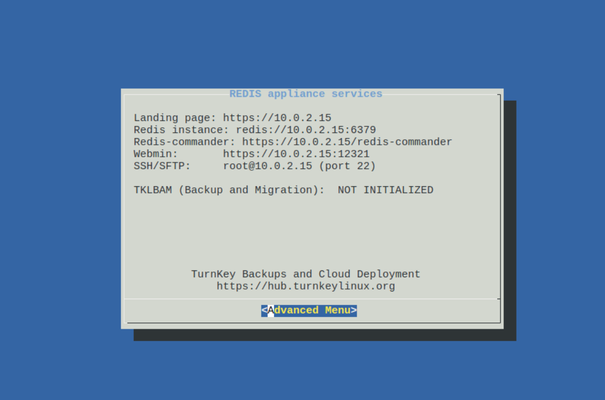

### 2. Создание контейнера _Nextcloud_ через _CLI_

Загрузите ещё один дефолтный образ для контейнера, на этот раз _Nextcloud_.

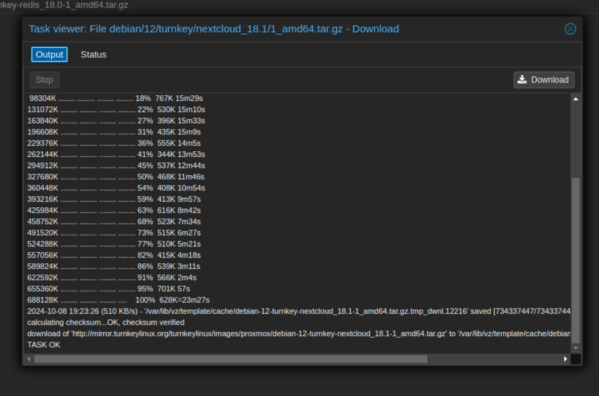

Создайте еще один контейнер из только что скачанного образа, но на этот раз с помощью _CLI_. Для этого необходимо 
подключиться к ВМ по SSH. Далее выполнить команду с помощью встроенной утилиты `pvesh`:

```bash
pvesh create /nodes/proxmox/lxc -vmid 101 -hostname nextcloud -unprivileged true -storage local -password "Ваш пароль" -net0 "name=eth0,bridge=vmbr0,ip=dhcp,firewall=yes" -ostemplate local:vztmpl/debian-12-turnkey-nextcloud_18.1-1_amd64.tar.gz -memory 512
```


Вернитесь в веб-интерфейс _Proxmox_, проверьте что новый контейнер действительно успешно создался. 
Подключитесь через `Console` аналогично шагу 2 как к _Redis_.

Инициализируйте контейнер с `Nextcloud` аналогично как _Redis_. На этапе с Redis вы получите ошибку — это ожидаемо, 
мы настроим подключение к нему позже, а пока выберите `Skip`. В качестве `Nextcloud Domain` желательно указать 
`localhost`.

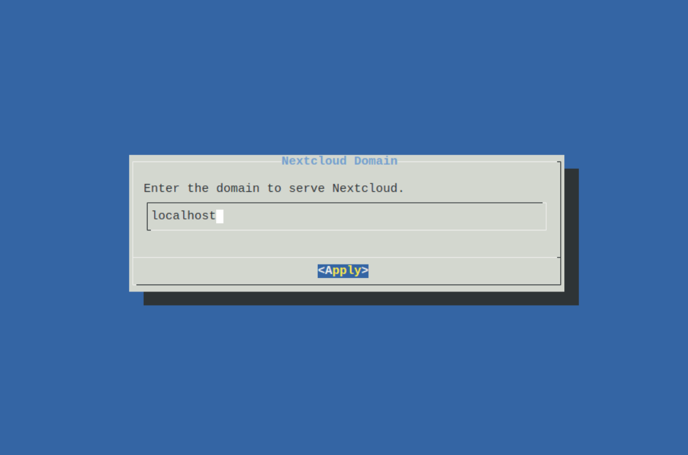

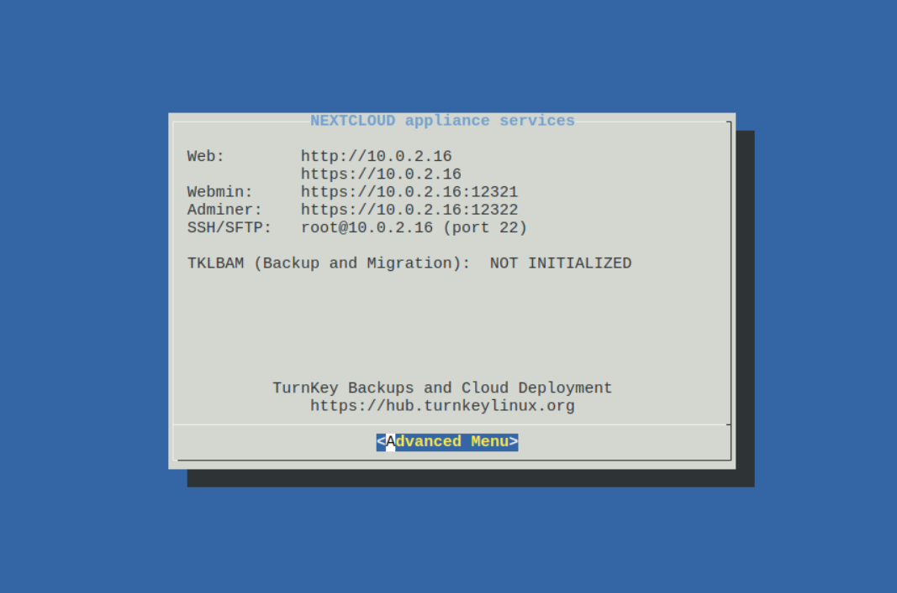

### 3. Настройка конфигурации _Nextcloud_

Аналогично шагам как в [Лабораторной работе №1](../lab_1/REPORT.md), настройте проброс портов
`127.0.0.1:443 -> adress-Nextcloud:443` и проверьте, действительно ли приложение запустилось.
Для этого перейдите в браузере по адресу https://localhost/ — там вы увидите ошибку сервиса, так как _Nextcloud_ не
смог найти _Redis_.


Вернитесь в консоль _Nextcloud_, откройте файл `/var/www/nextcloud/config/config.php` и замените адрес _Redis_ на
IP/port из 2 шага. Также отключите `Memcache`, удалив строку с `memcache.local`.

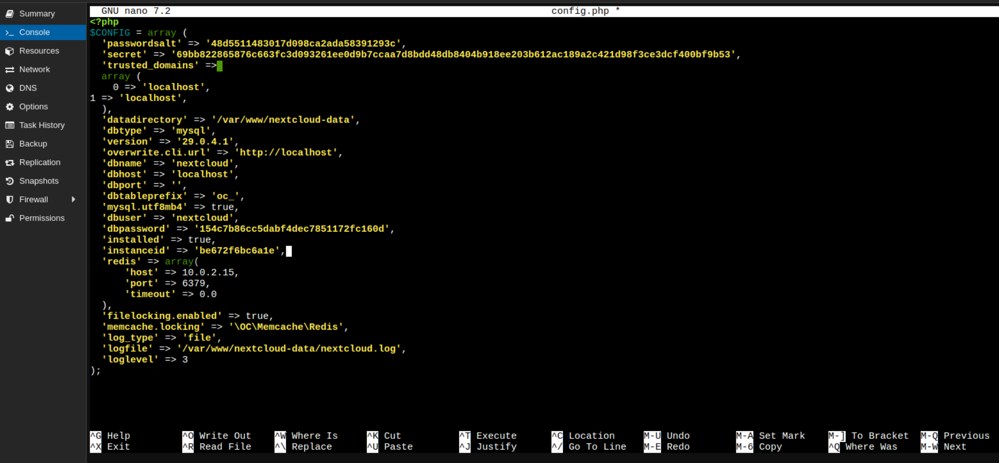

Вернитесь в браузер и убедитесь, что теперь форма входа в _Nextcloud_ открывается без ошибок.

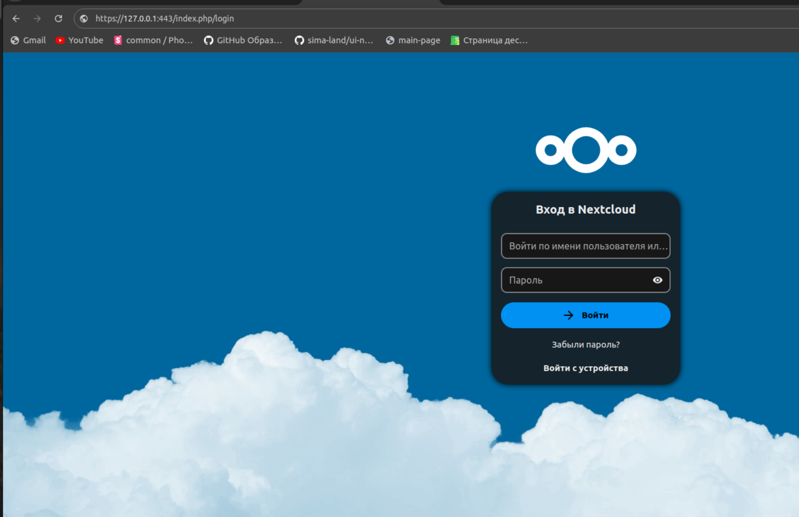

На этом знакомство с контейнерами в _Proxmox_ завершено.

## 4. Вопрос - ответ

**Вопрос**: Почему неправильная конфигурация на шаге 1 приведет (вероятнее всего) к полной потере сетевой доступности?

**Ответ**: Происходит создание сетевого бриджа, который заменяет текущий сетевой интерфейс и неправильная конфигурация 
может привести к тому, что _Proxmox_ не сможет правильно связаться с внешней сетью. Т.к. интерфейс не будет иметь 
корректной конфигурации для маршрутизации трафика, и соответственно, может потерять доступ ко всему сетевому 
окружению, включая веб-интерфейс управления _Proxmox_.

**Вопрос**: Почему адрес шлюза `default gateway` ВМ выглядит как `10.0.2.2`, а не `10.0.2.1`?

**Ответ**: Это происходит из-за конфигурации _VirtualBox_, которая создает NAT-сетевой интерфейс для ВМ. В данном 
случаи _VirtualBox_ использует адрес `10.0.2.2` как шлюз для сетей NAT. Это позволяет ВМ использовать данный адрес 
для подключения к внешним сетям через хостовую машину (где и находится _Proxmox_ с _VirtualBox_). 
То есть `10.0.2.2`, а не `10.0.2.1` - назначается _VirtualBox_ в качестве линка между ВМ и остальной частью сети

## Вывод

В результате мы научились:
- Создавать сетевые интерфейсы;
- Создавать контейнеры _LXC_ через интерфейс Proxmox и _CLI_;
- Настраивать конфигурацию контейнеров, в том числе _Nextcloud_.

[назад](../PROXMOX.md) | [меню](../../README.md) | [вперёд](../lab_3/REPORT.md)
